This article, named as "*Impact of admixture and ancestry on eQTL analysis and GWAS colocalization in GTEx*", owns some details as follows:

|Configurations|Details|
|:----|:----|
|Authors|Nicole R. Gay, Michael Gloudemans, Margaret L. Antonio, Nathan S. Abell, Brunilda Balliu, YoSon Park, Alicia R. Martin, Shaila Musharoff, Abhiram S. Rao, François Aguet, Alvaro N. Barbeira, Rodrigo Bonazzola, Farhad Hormozdiari, GTEx Consortium, Kristin G. Ardlie, Christopher D. Brown, Hae Kyung Im, Tuuli Lappalainen, Xiaoquan Wen & Stephen B. Montgomery|
|Journal|Genome Biology|
|Correspondence|Stephen B. Montgomery, Email: smontgom@stanford.edu|
|Citation|Gay, N.R., Gloudemans, M., Antonio, M.L. et al. Impact of admixture and ancestry on eQTL analysis and GWAS colocalization in GTEx. Genome Biol 21, 233 (2020). https://doi.org/10.1186/s13059-020-02113-0 |

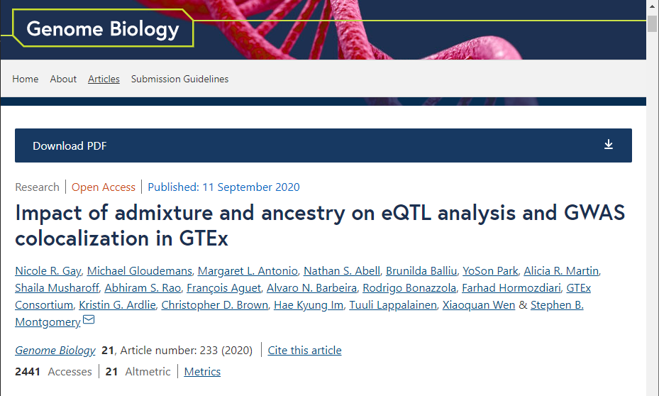

# Abstract
**Background**: Population structure among study subjects may **confound** genetic association studies, and lack of proper correction can lead to spurious findings. The **Genotype-Tissue Expression (GTEx)** project largely contains individuals of European ancestry, but the v8 release also includes up to 15% of individuals of non-European ancestry. Assessing ancestry-based adjustments in GTEx improves **portability** of this research across populations and further characterizes the impact of population structure on GWAS colocalization.

**Results**: Here, we identify a subset of 117 individuals in GTEx (v8) with a high degree of population admixture and estimate genome-wide local ancestry. We **perform genome-wide cis-eQTL mapping using admixed samples in seven tissues, adjusted by either global or local ancestry**. Consistent with previous work, we observe improved power with local ancestry adjustment. At loci where the two adjustments produce different lead variants, we observe 31 loci (0.02%) where a significant colocalization is called only with one eQTL ancestry adjustment method. Notably, both adjustments produce similar numbers of significant colocalizations within each of two different colocalization methods, COLOC and FINEMAP. Finally, we identify a small subset of eQTL-associated variants highly correlated with local ancestry, providing a resource to enhance functional follow-up.

**Conclusions**: We provide a local ancestry map for admixed individuals in the GTEx v8 release and describe the impact of ancestry and admixture on gene expression, eQTLs, and GWAS colocalization. While the majority of the results are concordant between local and global ancestry-based adjustments, we identify distinct advantages and disadvantages to each approach.

**Keywords**: Local ancestry, Population structure, Admixture, eQTL, Colocalization, GTEx, Gene expression

## Translation

* 背景：研究对象之间的群体结构可能会混淆遗传关联研究，缺乏适当的校正可能导致错误的结果。基因类型-组织表达(GTEx)项目主要包含欧洲血统的个体，但V8版本也包括高达15%的非欧洲血统的个体。评估GTEx中基于祖先的调整提高了这项研究在人群中的可移植性，并进一步表征了人口结构对GWAS共同定位的影响。

* 结果：在这里，我们确定了GTEx(V8)中具有高度人口混合性的117个个体的子集，并估计了全基因组的局部祖先。我们使用混合样本在七个组织中进行全基因组顺-eQTL定位，根据全球或本地血统进行调整。与以前的工作一致，我们观察到随着当地血统的调整，权力得到了改善。在两种调节产生不同导联变异的位点上，我们观察到31个位点(0.02%)只用一种eQTL祖先调节方法进行显著的共定位。值得注意的是，这两种调整在两种不同的协同定位方法(COLOC和Finemap)中的每一种中都产生了相似数量的显著协同定位。最后，我们确定了与当地血统高度相关的eQTL相关变异的一小部分，为增强功能后续研究提供了资源。

* 结论：我们在GTEx V8版本中为混合个体提供了一个局部祖先图谱，并描述了祖先和混合个体对基因表达、eQTL和GWAS共定位的影响。虽然大多数结果在基于当地和全球血统的调整之间是一致的，但我们确定了每种方法的明显优势和劣势。

* 关键词：本地血统、种群结构、混合、eQTL、共定位、GTEx、基因表达

## Analysis
This article focuses on the study of confounder: the admixture of ancestry, which is part of usual batch effects. In the original GTEx project, 15 PCs are used to eliminate these batch effects while a **Global ancestry** adjustment is subsequently applied. According to Ref. 5 (*[Properties of global- and local-ancestry adjustments in genetic association tests in admixed populations](https://pubmed.ncbi.nlm.nih.gov/29288582/)*), a GA (global ancestry) refers to the average ancestry across the genome, and a LA (local ancestry) means the ancestry at a specific chromosomal location.
Population substructure can lead to confounding in tests for genetic association, and failure to adjust properly can result in spurious findings. To be specific, conclusions of these confouders are depicted as in Ref. 5 : " We show that **admixture does not lead to confounding** when the trait locus is tested directly **in a single admixed population**. However, if there is **more complex population structure or a marker locus in linkage disequilibrium (LD) with the trait locus is tested, both global and local ancestry can be confounders**. " Inspired by this statement, the eQTL and GWAS results of previous GTEx must be considered thoughfully when the population structure has changed, or enlarged.

# Introduction
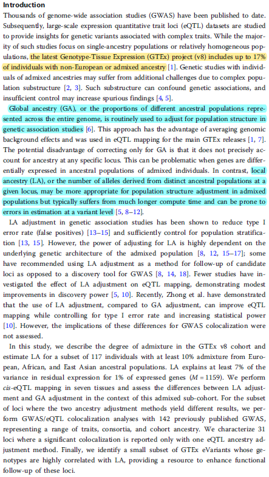

## Translation

**前言**

到目前为止，已有数千项全基因组关联研究(GWAS)被发表。随后，大规模表达数量性状基因座(EQTL)数据集被研究以提供与复杂性状相关的遗传变异的见解。虽然大多数这类研究集中在单一血统群体或相对同质的群体，但最新的基因类型-组织表达(GTEx)计划(V8)包括多达17%的非欧洲血统或混血血统的个体[1]。由于复杂的种群亚结构，对混合祖先个体的遗传学研究可能会遇到额外的挑战[2，3]。这样的亚结构可能会混淆遗传关联，而控制不足可能会增加错误的发现[4，5]。

全球祖先(GA)，即代表整个基因组的不同祖先群体的比例，通常被用来调整遗传关联研究中的群体结构[6]。这种方法具有平均基因组背景效应的优点，并被用于主要GTEx版本的eQTL定位[1，7]。只修正遗传基因的潜在缺点是，它不能准确地解释任何特定位点的祖先。当基因在混合个体的祖先群体中差异表达时，这可能是有问题的。相反，地方血统(LA)，即来自不同祖先群体在给定位点的等位基因数量，可能更适合于混合群体的群体结构调整，但通常需要更长的计算时间，并且在不同的水平上容易出现估计错误[5，8-12]。

基因关联研究中的LA调整已被证明**可以降低I型错误率(假阳性)[13-15]，并充分控制人口分层[13，15]**。然而，调整LA的能力高度依赖于混合群体的潜在遗传结构
[8，12，15-17]；一些人建议使用LA调整作为跟踪候选基因座的方法，而不是GWAS的发现工具[8，14，18]。**很少有研究调查LA调整对eQTL定位的影响，显示出发现能力的适度改善[5，10]**。最近，钟等人提出了自己的观点。已经证明，与遗传调整相比，使用LA调整可以改善eQTL定位，同时控制I型错误率并增加统计能力[10]。然而，这些差异对GWAS共定位的影响并未得到评估。

在这项研究中，我们描述了GTEx V8队列中的混合程度，并估计了117个个体的LA，其中至少有10%的混合来自欧洲、非洲和东亚的祖先群体。LA可以解释1%的表达基因(M=1159)残留表达的至少7%的变异。我们在七个组织中进行了顺式eQTL定位，并在这个混合亚群的背景下评估了LA调节和GA调节之间的差异。对于两种祖先调整方法产生不同结果的基因座子集，我们对142个先前发表的代表一系列性状、群体和队列祖先的GWAS/eQTL共定位进行了分析。我们用一种eQTL系谱调整方法确定了31个显著共定位的基因座的特征。最后，我们确定了GTEx eVariant的一小部分，它们的基因型与LA高度相关，为加强这些基因座的功能随访提供了资源。

# Result 1

## Translation

**GTEx包括非洲和亚洲混合人群**

GTEx V8版本包括838个个体的全基因组测序和基因表达数据，其中包括103个非洲裔美国人和12个亚裔美国人(自报血统)。全基因组基于基因型的主成分(GPC)反映了遗传，并在GWAS[6，9，13]和eQTL研究中用于调整种群结构[7]。因此，为了了解GTEx中代表的人口混合程度，我们将前两个GPC与自我报告的祖先进行了比较(图1A)。图1a显示gp1和gp2分别反映了非洲人和亚洲人的血统；大多数欧洲裔美国人(715人中有698人)。
在原点附近聚集在一起，表明这一簇中的样本是相对均匀的欧洲后裔。当用GTEx和1000个基因组数据[19](附加文件1，图S1)进行基因型PCA时，观察到的这些模式具有更高的分辨率。保留了117个个体的子集，其中超过10%的人群混合，称为117AX，用于下游分析(图1A；附加文件2，表S1)。在GTEx V8版本中用于QTL发现的49个组织具有不同的117AX代表。其中27个组织的样本大小至少为30个混合个体(图1B)。

图2(附加文件1)提供了所有49个组织的样本大小。相对于每个组织的总样本量(平均7%)，垂体和13个中枢神经系统组织的代表性最低，为117AX。我们根据最小混合样本量60[20]和与已知人群差异表型的相关性(例如皮下脂肪和体脂分布[21，22]，N=84；不暴露(NSE)皮肤和表皮基因表达[23]，N=71；肺和哮喘患病率[24]，N=64；骨骼肌和瘦肉量[25]，N=98)，选择了7个组织进行顺式eQTL调用。W h o l e b l o o d(N=9 5)a n d t i b i a l a r t e r y(N=89)也被包括在内，因为它们有很大的117AX样本量。

使用RFMix[26]，我们在117AX上执行了三个人口(欧洲、非洲和东亚)的LA估计(见“方法”部分；图1C；附加文件1，图S3)。我们提供这些LA调用作为进一步研究GTEx数据的资源(附加文件3，表S2)。对于每个个体，全基因组LA被平均以提供GA估计。117AX的每个样本都不到90%的遗传基因来自欧洲、非洲和东亚以外的任何一个祖先人口。我们将这些GA比例与前5个GPC进行了关联，这定量地证明了GPC1与非洲血统(r=−0.98)和GPC2与东亚血统(r=1.0；图1D)之间的密切关系。

为了评估LA在基因表达方面的重要性，我们采用了一种现有的方法[27]，在考虑了GA之后，计算了LA在117AX基因表达中解释的方差比例，反之亦然(见“方法”一节；图1E；附加文件4，表S3)。平均而言，在我们感兴趣的七个组织中，GA比LA在每个基因的转录起始点解释了更多的基因表达差异(P值<2.2E−16，双侧t检验)。然而，LA至少解释了1%表达基因残留表达的7%的变异(M=1159)。在极端情况下，LA解释了人类特异性癌基因TBC1结构域家族成员3(TBC1D3)在肺中残存表达的32%的差异；在所有被测试的七个组织中，LA也解释了比GA更多的TBC1D3表达的差异(P值=0.0018，双侧t检验)。在另一项关于拷贝数的单独研究中，TBC1D3是变异性最大的人类基因家族之一(中位数为38.13,159个个体的变异为93.2个拷贝)，并且按人群分层(在欧洲、亚洲和约鲁班样本中的平均拷贝数分别为29.28、34.17和43.86个拷贝数)[29]。LA捕获的基因表达残差的生物学证据支持在eQTL定位中考虑LA的重要性。

**图名翻译**

**图1** GTEx V8队列中的混合人群。

**A**基因型主成分(GPC)反映全球血统。分数由自我报告的血统决定。圈出的圆点表示117个被定义为混血(117AX)的个体。

**B** GTEx V8组织的一个子集具有至少30个117AX样本量。选择用于117AX顺式eQTL定位的七个组织以彩色和粗体显示。

**C**-LA区将同一亲本染色体上的连续变异折叠成相邻的单倍型区块。当地祖先的精细空间分辨率与传说中显示的全球祖先比例形成了鲜明对比。单倍型(列)由个体配对；行是常染色体。个人按欧洲混合比例从左到右排序。

**D**-GPC与全基因组本地血统平均的全球血统比例高度相关。

**E**本地(或全球)血统解释了校正全球(或本地)血统后残留基因表达的一小部分变异。局部祖先被定义为每个基因转录起始点的局部祖先；全球祖先是前五个GPC。点按组织着色；颜色对应b.SUBC，皮下；NSE，不暴露在阳光下；VE，方差解释；LA，本地血统；GA，全球血统

# Result 2

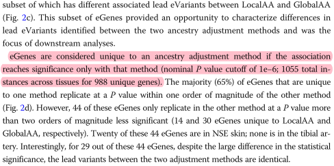

## Translation

**地方血统调整提高了在cis-eQTL定位中的发现能力**

我们在混合群体(117AX)中进行了顺式eQTL定位，以确定变异与图1B所示的七个组织中每一个组织内基因表达之间的关联(见“方法”部分；附加文件5，表S4)。我们实现了线性模型来测试每个基因-顺式变量对之间的关联。对每对人进行了两项关联性测试：第一项针对全球血统进行调整(GlobalAA)，第二项针对本地血统进行调整(LocalAA)。重要的是，LocalAA计算了每个变异的欧洲、非洲和东亚等位基因的数量，而GlobalAA使用前五个基因型主成分作为全球血统的替代，实现了与GTEx eQTL调用管道中使用的相同的血统调整。GlobalAA和LocalAA中所有关联测试的名义P值(-log10)的分位数-分位数图表明，对于七个组织中的六个组织，LocalAA相对于GlobalAA具有更显著的P值(以最高分位数表示)，NSE皮肤在两种方法之间显示出更相似的P值分布(图2A)。这证实了先前的发现，在顺式-eQTL定位中，LA调整比GA调整导致更显著的标称P值[10]。我们应用了标称的P值截止值1e−6来识别重要的eQTL；这个阈值非常接近eQTL随后通过5%的错误发现率截止值所需的阈值(附加文件1，图S4)。在所有七个组织中，局部AA调用的Egene多于全局AA调用的Egene(P值=0.0078，二项概率)(图2B)。这两种方法之间的大部分Egene重叠，

其中一个子集在LocalAA和GlobalAA之间具有不同的关联Lead eVariant(图2C)。Egene的这一子集提供了一个机会来描述两种血统调整方法之间发现的铅eVariant的差异，并且是下游分析的重点。如果只有一种血统调整方法的关联性达到显著水平(标称为Pv a l u e c u t of f f 1 e e−6；共有1,055个组织中的988个独特基因)，则egene被认为是该方法所特有的。大多数(65%)的Egene是一种方法特有的，在另一种方法的一个数量级内以P值复制(图2D)。然而，这些Egene中的44个仅在另一种方法中以P值低两个数量级以上的显著程度复制(分别有14个和30个Egene是LocalAA和GlobalAA所独有的)。这44个Egene中有20个位于NSE皮肤，没有一个位于胫骨动脉。有趣的是，对于这44个Egene中的29个，尽管在统计意义上存在很大差异，但两种调整方法之间的领先变量是相同的。

**图名翻译**

**图2** LocalAA或GlobalAA调用的cis-eQTL的比较。对7个组织进行了cis-eQTL定位。标称P值阈值为1E−6，用于确定显著相关性。

**A** 所有测试的名义P值的Q-Q图表明，使用LocalAA时，大多数组织的功率有轻微的改善。

**B** 在所有7种组织中.局部AA比全局AA发现更多的Eg基因(P值=0.0078，二项概率)。

**C** 大多数Egene是通过两种血统调整方法(灰色+紫色)来鉴定的。这两种方法报告了这些Egene中的一小部分(紫色)的不同eVariant。数字表示由一种谱系调整方法唯一调用的Egene，其被绘制在d中。

**d** 如地毯图所示，一种谱系调整方法所特有的大多数Egene落在显著阈值附近。虚线划分了一个区域，在该区域之外，一种方法中的Egene的标称P值至少比另一种方法高出两个数量级。点由组织着色

# Result 3
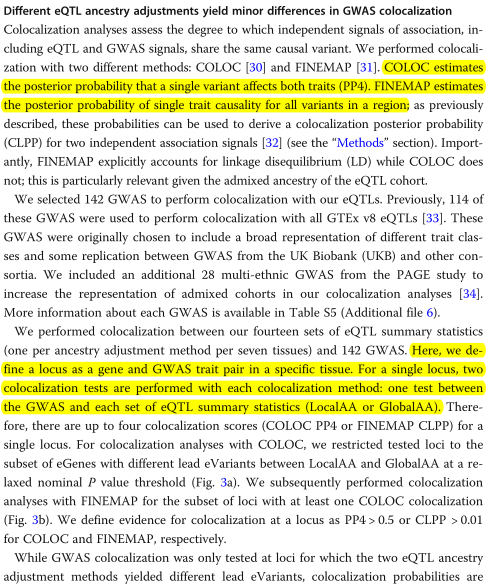

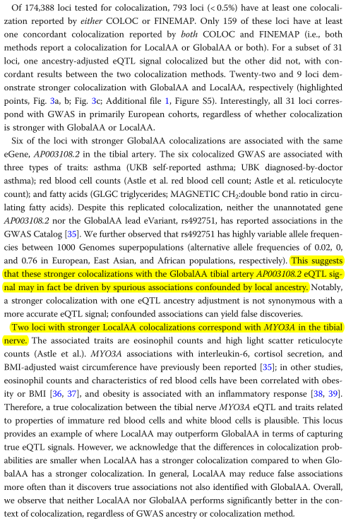

## Translation

**不同的eQTL谱系调整产生GWAS共定位的细微差异**

共定位分析评估独立关联信号(包括eQTL和GWAS信号)共享相同因果变量的程度。我们用两种不同的方法进行共定位：COLOC[30]和n d F I N E M A P[31]。COLOC估计单个变异影响两个性状的后验概率(PP4)。FINEMAP估计一个区域中所有变量的单个性状因果关系的后验概率；如前所述，这些概率可以用来推导出两个独立关联信号的共局定位后验概率(CLPP)[32](S e t t h e e“Methods”一节)。重要的是，finemap明确解释了连锁不平衡(LD)，而COLOC没有；考虑到eQTL队列的混合血统，这一点特别相关。我们选择了142个GWAS与我们的eQTL进行共定位。在此之前，这些GWAS中的114个用于与所有GTEx V8 eQTL进行共定位[33]。最初选择这些GWA是为了包括不同性状类别的广泛代表性，以及英国生物库(UKB)和其他联盟的GWA之间的一些复制。我们从PAGE研究中额外纳入了28个多种族的GWA，以增加混杂队列在我们的共同定位分析中的代表性[34]。表S5(附加文件6)提供了有关每个GWAS的更多信息。我们在14组eQTL汇总统计量(每7个组织一种血统调整方法)和142组GWAS之间进行了协同定位。在这里，我们将一个基因位点定义为特定组织中的一个基因和GWAS性状对。对于单个位点，用每种共定位方法执行两个共定位测试：一个测试在GWAS和每组eQTL汇总统计量(LocalAA或GlobalAA)之间。因此，单个基因座最多有四个共定位得分(COLOC PP4或Finemap CLPP)。对于与COLOC的共定位分析，我们在一个放松的名义P值阈值下，将测试的位点限制在LocalAA和GlobalAA之间具有不同前导eVariant的Egene子集(图3A)。随后，我们用Finemap对至少有一个COLOC共定位的基因座子集进行了共定位分析(图3B)。我们分别将COLOC和FINEMAP的PP4>0.5或CLPP>0.01定义为位点共定位的证据。虽然GWAS共定位仅在两种eQTL系谱调整方法产生不同导联eVariant的基因座上进行测试，但共定位概率在
两种方法之间无系统差异(COLOC和FINEMAP分别为P值=0.791和P值=0.324；双侧t检验)。此外，具有较强的共定位证据(COLOC PP4>0.5或FINEMAP CLPP>0.01)的基因座，无论采用何种校正方法，其共定位的后验概率都很高，这表明两种血统调整都能捕捉到稳健的效应。

在共定位检测的174,388个位点中，有793个位点(<0.5%)至少有一个共定位由COLOC或FINEMAP报告。COLOC和FINEMAP都报告了至少一个一致性共定位(即，两种方法都报告了LocalAA和/或GlobalAA的共定位)，其中只有159个基因座具有至少一个一致的共定位(即，这两种方法都报告了LocalAA和/或GlobalAA的共定位)。对于31个座位的子集，一个祖先调整的eQTL信号共定位，而另一个没有，这两种共定位方法的结果是一致的。22 9个基因座分别与GlobalAA和LocalAA显示出更强的共定位(突出显示的点，图3A，b；图3C；附加文件1，图S5)。有趣的是，无论GlobalAA和LocalAA的共局性更强，所有31个基因座都与主要在欧洲的队列中的GWAS相一致。在GlobalAA共定位较强的位点中，有6个与同一Egene AP003108.2(位于胫动脉)相关。六个共同定位的GWAS与三种类型的特征相关：哮喘(UKB自我报告哮喘；UBK医生诊断哮喘)；红细胞计数(Astle等人。红细胞计数；Astle等人。网织红细胞计数)；脂肪酸(GLGC甘油三酯；磁性CH2：循环脂肪酸中的双键比率)。尽管这种重复的共定位，但无论是未注释的基因AP003108.2还是GlobalAA Lead eVariant，rs492751，都没有在GWAS目录中报告关联[35]。我们进一步观察到rs492751在1000个基因组超群体之间具有高度可变的等位基因频率(在欧洲、东亚和非洲群体中的交替等位基因频率分别为0.02、0和0.76)。这表明，这些与GlobalAA胫动脉AP003108.2 eQTL信号的较强共定位实际上可能是由地方血统混淆的虚假关联驱动的。值得注意的是，一个eQTL祖先调整的较强共定位并不等同于一个更准确的eQTL信号；混淆的关联可能产生错误的发现。两个定位较强的位点对应于胫神经中的MYO3A。相关特征是嗜酸性粒细胞计数和高光散射网织红细胞计数(Astle等人)。MYO3A与白细胞介素6、皮质醇分泌和BMI调节腰围之间的关系此前已有报道[35]；在其他研究中，红细胞的嗜酸性粒细胞计数和特征与肥胖或BMI相关[36，37]，而肥胖与炎症反应相关[38，39]。因此，胫神经MYO3A eQTL与未成熟红细胞和白细胞特性相关性状之间的真正共存是可能的。这个位点提供了一个例子，说明在捕获真实eQTL信号方面，LocalAA可能优于GlobalAA。然而，我们承认，与GlobalAA具有更强的协同定位相比，当LocalAA具有更强的协同定位时，协同定位概率的差异较小。一般而言，与发现与GlobalAA不同的真实关联相比，LocalAA可以更频繁地减少虚假关联。总体而言，我们观察到，无论是GWAS血统还是共定位方法，LocalAA和GlobalAA在共定位的背景下都没有明显更好的表现。

**图名翻译**

**图3** eQTL血统调整方法对与GWAS共定位的影响a,b 我们对局部Aa和GlobalAA调用具有不同前导eVariant的eQTL的座位子集进行了共定位(标称P值阈值为1e−4)。每个点代表在单个egene附近的GWAS/eQTL共定位测试(由eQTL组织染色)。X轴和y轴分别表示使用GlobalAA或LocalAA eQTL信号进行协同定位的后验概率。两个小区中突出显示的同一31个点对应于一个祖先调整的eQTL信号共定位而另一个不是，两种共定位方法的结果是一致的。对本地AA和全球AA调用不同导联eQTL的所有位点(标称P值阈值为1e−4)进行共定位。共定位的后验概率(PP4)阈值为0.5，用于识别与COLOC的共定位事件。对于COLOC报告共定位的基因座子集(即，a中的有色点)，也使用finemap执行共定位。共定位后验概率(CLPP)以log10标度表示。CLPP阈值为0.01，用于识别Finemap的协同定位事件。C共定位后验概率是a和b中突出显示的31个位点的后验概率。值越大，表明共定位越强。相关的eQTL组织用x轴下方的彩色圆圈和刻度线表示。SR，自行报告；DBD，由医生诊断；N，计数
(just a ref, this should be read by the readers not by this trans.)

# Result 4

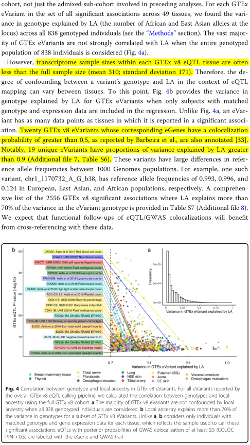

## Translation

**GTEx V8 eVariant的一个子集与当地血统高度相关**

实施本地AA而不是全球AA的一个理由是，它具有独特的能力，可以避免被当地人口结构搞混[15]。我们检查了整个GTEx V8eQTL调用管道报告的所有重要关联，以寻找与LA混淆的证据。请注意，此分析已扩展到包括完整的GTEx V8队列，而不仅仅是前面分析中涉及的混合子队列。对于49个组织中所有显著关联集合中的每个GTEx eVariant，我们发现在所有838个基因型个体中，由LA(该基因座上非洲和东亚等位基因的数量)解释的基因型差异(见“方法”部分)。当考虑到整个838个个体的基因型人群时，绝大多数GTEx eVariant与LA没有很强的相关性(图4A)。然而，每个GTEx V8 eQTL组织内的转录本样本大小通常是l e s s t h a n t h f u l l s a m p l e s i z e(m e a n 3 1 0；s标准偏差171)。因此，在eQTL定位的背景下，变异体的基因型和LA之间的混淆程度在不同组织之间可能会有所不同。在这一点上，图4B提供了由LA解释的GTEx eVariants的基因型差异，当回归中只包括具有匹配的基因型和表达数据的受试者时。与图4A不同，eVariant具有与组织一样多的数据点，在这些数据点中，eVariant以显著的关联性被报告。Barbeira等人报道的20个GTEx V8 eVariant的对应Egene的共定位概率大于0.5的eVariant也被注释[33]。值得注意的是，19个独特的eVariant的LA解释的方差比例大于0.9(附加文件7，表S6)。这些变异在1000个基因组群体中的参考等位基因频率有很大差异。例如，其中一个变异Chr1_1170732_A_G_B38在欧洲、东亚和非洲人群中的参考等位基因频率分别为0.993、0.996和0.124。表S7(附加文件8)提供了2556个GTEx V8显著关联的综合列表，其中LA解释了eVariant基因型70%以上的变异。我们期望eQTL/GWAS共定位的功能性随访将受益于与这些数据的交叉参考。

**图名翻译**

**图4**
GTEx V8 eVariant的基因型与当地血统的相关性。对于整个GTEx V8 eQTL调用管道报告的所有eVariant，我们使用完整的GTEx V8队列计算了基因型与当地血统之间的相关性。当考虑到所有838个基因型个体时，大多数GTEx V8 eVariant不会受到当地血统的困扰。B地方血统可以解释GTEx V8 eVariant子集70%以上的基因型差异。与a不同，b只考虑每个组织具有匹配的基因型和基因表达数据的个体，这反映了用来描述这些重要关联的样本。GWAS共定位后验概率至少为0.5(COLOC PP4>0.5)的eQTL被标记为Egene和GWAS性状

# Discussion
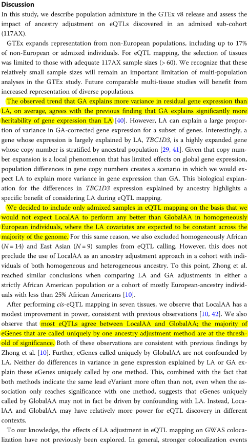
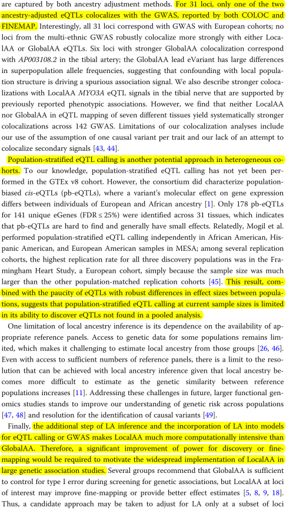

## Translation
**讨论**

在这项研究中，我们描述了GTEx V8版本中的混合种群，并评估了世系调整对混合亚群(117AX)中发现的eQTL的影响。

GTEx扩大了非欧洲人口的代表性，包括高达17%的非欧洲人或混血儿。对于eQTL定位，选择的组织仅限于具有足够117AX样本量(>60)的组织。我们认识到，在GTEx研究中，这些相对较小的样本量仍将是多总体分析的一个重要限制。未来的可比性多组织研究将受益于增加不同人群的代表性。所观察到的GA比LA更能解释残存基因表达差异的趋势，与先前的研究结果一致，即GA比LA更能解释基因表达的遗传力[40]。然而，LA可以解释基因子集中GA校正后的基因表达的很大比例的差异。有趣的是，一个主要由LA解释其表达的基因，TBC1D3，是一个高度扩展的基因，其拷贝数按祖先群体分层[29，41]。鉴于拷贝数扩张是一种局部现象，对全球基因表达的影响有限，基因拷贝数的群体差异创造了一种情景，在这种情况下，我们预计LA比GA能够解释更多的基因表达差异。这种由祖先解释的TBC1D3表达差异的生物学解释突出了在eQTL定位过程中考虑LA的特殊好处。

我们决定在eQTL作图中只包括混合样本，因为我们不希望LocalAA在同质的欧洲个体中表现得比GlobalAA更好，因为在欧洲的大多数基因组中，LA协变量预计是恒定的。出于同样的原因，我们还排除了同源非洲(N=14)和东亚(N=9)样本的eQTL调用。然而，这并不排除在既有同质血统又有异质血统的人群中使用LocalAA作为一种血统调整方法。在这一点上，钟等人。在比较严格的非裔美国人和大部分是欧洲血统的非裔美国人占比低于25%的人群中洛杉矶和GA的调整时，得出了类似的结论[10]。

在对七个组织进行顺式eQTL定位后，我们观察到LocalAA在能力上有适度的改善，这与之前的观察结果一致[10，42]。我们还观察到，大多数eQTL在LocalAA和GlobalAA之间是一致的；大多数由一种祖先调节方法唯一调用的EQTL都处于显著水平。这两个观察结果都与钟等人之前的发现是一致的。[10]。此外，由GlobalAA唯一调用的Egene不会被LA混淆。LA或GA解释的基因表达差异也不能解释由一种方法唯一调用的这些Egene。这一点，再加上这两种方法往往表明相同的前导eVariant，即使只有一种方法达到显著水平，这表明GlobalAA唯一调用的Egene实际上可能不是由与LA的混淆驱动的。相反，LocalAA和GlobalAA可能在不同的上下文中拥有相对更大的eQTL发现能力。

据我们所知，eQTL定位中LA调节对GWAS共定位的影响还没有被研究过。一般而言，较强的共址事件都被这两种祖先调整方法捕获。COLOC和FINEMAP都报道，在31个位点中，两个祖先调整的eQTL中只有一个与GWAS共定位。有趣的是，所有31个基因座都与GWAS和欧洲队列相对应；来自多种族GWAS的基因座没有一个与LocalAA或GlobalAA eQTL发生更强烈的共定位。6个GlobalAA共定位较强的基因座对应于胫动脉AP003108.2；GlobalAA先导eVariant在超群等位基因频率上存在较大差异，提示与当地人群结构的混杂正在驱动一种虚假的关联信号。我们还描述了在胫神经中与LocalAA MYO3A eQTL信号的更强的共定位，这是先前报道的表型关联所支持的。然而，我们发现，在七个不同组织的eQTL定位中，LocalAA和GlobalAA都没有在142个GWAS中产生系统性更强的共定位。我们共定位分析的局限性包括我们使用了每个性状一个因果变量的假设，以及我们没有尝试对次级信号进行共定位[43，44]。

群体分层eQTL调用是异质队列中另一种潜在的方法。据我们所知，在GTEx V8队列中还没有进行群体分层的eQTL调用。然而，该联盟确实描述了群体偏向的顺式-eQTL(PB-eQTL)，在这种情况下，变异对基因表达的分子效应在欧洲和非洲血统的个体之间是不同的[1]。在31个组织中共检测到141个独有eQTL的178pB-eQTL(FDR≤为25%)，这表明pB-eQTL很难找到，而且效果一般较小。与此相关的是，Mogil等人。在梅萨的非洲裔美国人、西班牙裔美国人和欧洲裔美国人样本中独立进行了群体分层eQTL调用；在几个复制队列中，所有三个发现群体的最高复制率出现在欧洲队列的Framingham Heart Study中，这仅仅是因为样本量比其他人群匹配的复制队列大得多[45]。这一结果，再加上群体间效应大小存在显著差异的eQTL的缺乏，表明在当前样本量下的群体分层eQTL在发现汇集分析中没有发现的eQTL的能力方面是有限的。

地方血统推断的一个局限性是它依赖于适当的参照板的可用性。一些群体获得遗传数据的途径仍然有限，这使得估计这些群体的当地血统具有挑战性[26，46]。即使获得了足够数量的参考面板，考虑到随着参考群体之间的遗传相似性的增加，地方祖先变得更难估计，利用本地血统推断所能达到的分辨率也是有限的[11]。在未来应对这些挑战，更大规模的功能基因组学研究将提高我们对人群间遗传风险的理解[47，48]，并解决因果变异的识别问题[49]。

最后，LA推理的额外步骤以及LA被纳入eQTL调用或GWAS的模型中，使得LocalAA比GlobalAA在计算上更加密集。因此，需要显著提高发现或精细作图的能力，以推动LocalAA在大型遗传关联研究中的广泛应用。几个小组建议，GlobalAA足以控制遗传关联筛查过程中的I型错误，但感兴趣基因座的LocalAA可能会改善精细定位或提供更好的效果估计[5，8，9，18]。因此，可以采取候选方法来仅在位置的子集处调整LA其中LA有望改进精细映射，这将降低计算成本，并最大限度地发挥LA调整的潜在效益。

一个实际的例子是利用GlobalAA进行eQTL定位，然后评估LA对发现的eQTL所解释的残差方差。为了评估这一点，我们对GTEx版本eVariants进行了事后分析，发现了2556个具有大量由本地血统(>70%)解释的差异的关联。选择一个阈值来简单地排除基于当地血统解释的vari和nce的QTL仍然是一个挑战。我们提供这份清单是为了加强对eQTL/GWAS关联的未来分析。

# Conclusion
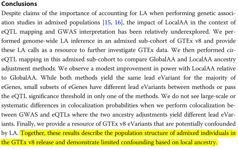

## Translation
尽管在混合人群中进行遗传关联研究时，解释LA很重要[15，16]，但在eQTL定位和GWAS解释的背景下，LocalAA的影响还相对不足。我们在GTEx V8混合亚群中进行全基因组LA推断，并提供这些LA调用作为进一步研究GTEx数据的资源。然后，我们在这个混合的亚群中进行ciseQTL定位，以比较GlobalAA和LocalAA血统调整方法。我们观察到，与GlobalAA相比，LocalAA在功率方面略有改善。虽然这两种方法对大多数egene产生相同的前导eVariant，但较小的egene子集在不同方法之间具有不同的前导eVariant，或者只有一种方法超过eQTL显著阈值。当我们在GWAS和eQTL之间进行共定位时，我们没有看到大规模或系统性的共定位概率差异，因为这两个祖先的调整产生了不同的Lead eVariant。最后，我们提供了GTEx V8eVariant的资源，这些eVariant可能会被LA混淆。总而言之，这些结果描述了GTEx V8版本中混合个体的种群结构，并证明了基于当地血统的有限混杂。

# Method
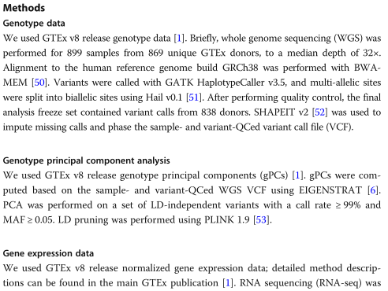
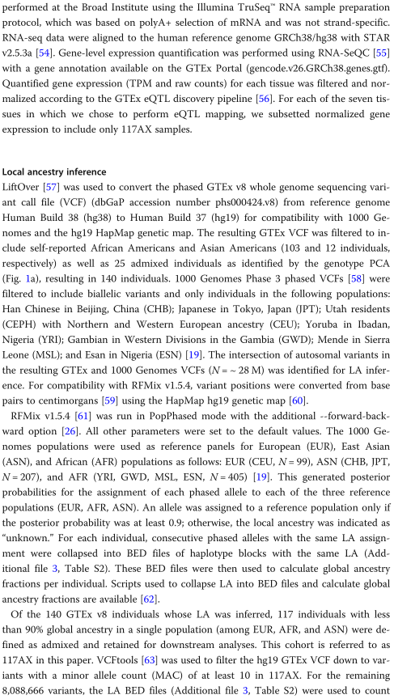

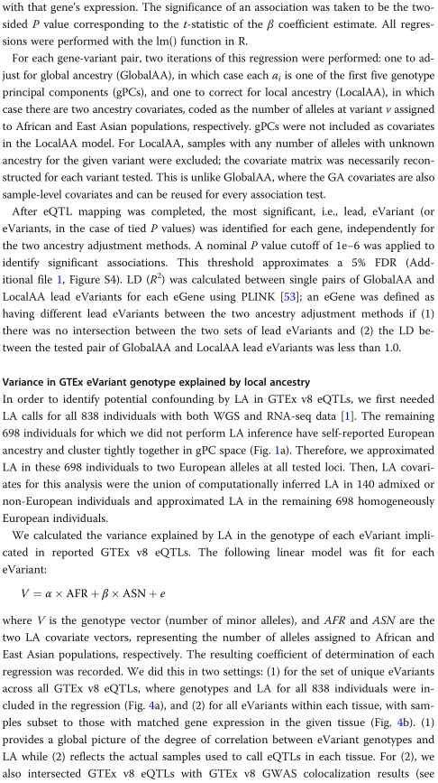

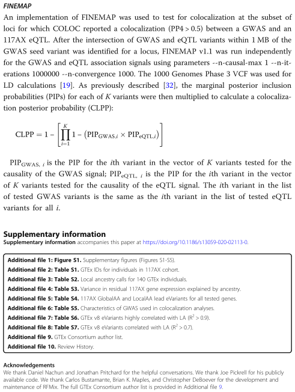

## Translation

**方法**

**基因型数据**

采用GTEx V8释放基因型数据[1]。简而言之，对来自869个独特的GTEx供体的899个样本进行了全基因组测序，测序深度中位数为32×。用BWAMEM[50]进行与人类参考基因组构建GRCh38的比对。用GATK HaplotypeCaller v3.5调用变异体，用Hail v0.1[51]将多等位基因位点分裂成双等位基因位点。在进行质量控制后，最终分析冻结组包含了838名捐赠者的不同电话。SHAPEIT v2[52]用于归因于丢失的调用，并对样本和变量QCed变量调用文件(VCF)进行阶段化。

**基因型主成分分析**

我们使用GTEx V8释放的基因型主成分(GPC)[1]。使用EIGENSTRAT[6]，基于样本和变量QCed的WGS VCF计算GPC。对一组与LD无关的变异体进行主成分分析，呼叫率≥为99%，MAF≥为0.05%。使用PLINK 1.9[53]进行LD修剪。

**基因表达数据**

我们使用了GTEx V8版本的归一化基因表达数据；详细的方法描述可以在GTEx的主要出版物[1]中找到。RNA测序(RNA-seq)在博德研究所使用Illumina TruSeqRNA样品制备方案进行检测，该方案基于PolA+™选择，并且不是链特异性的。RNA-seq数据与人类参考基因组GRCh38/hg38和STAR v2.5.3a[54]进行比对。使用RNA-SEQC[55]和GTEx门户网站(gencode.v26.GRCh38.genes.gtf)上提供的基因注释进行基因水平的表达定量。根据GTEx eQTL发现管道，对每个组织的量化基因表达(TPM和RAW计数)进行过滤和归一化[56]。对于我们选择进行eQTL定位的七个组织中的每一个，我们将归一化基因表达子集仅包括117AX样本。

**使用本地祖先推断**

提升[57]将阶段性GTEx V8全基因组测序变体调用文件(VCF)(DBGaP登录号phs000424.v8)从参考基因组Human Build 38(Hg38)转换为Human Build 37(Hg19)，以与1000个基因组和hg19 HapMap遗传图谱兼容。将得到的GTEx VCF过滤后，包括自我报告的非洲裔美国人和亚裔美国人(分别为103人和12人)，以及由PCA基因型鉴定的25名混合个体(图1A)，得到140名个体。对1000个基因组第三阶段阶段VCF[58]进行了筛选，以包括双等位变异，且仅包括以下人群中的个体：中国北京的汉族(CHB)；日本东京的日本人(JPT)；具有北欧和西欧血统的犹他州居民(CEPH)；尼日利亚伊巴丹(YRI)的约鲁巴人(YRI)；冈比亚西区的冈比亚人(GWD)；塞拉利昂的门德人(MSL)；以及尼日利亚的埃桑人(ESN)[。在得到的GTEx和1000个基因组VCFs(N=~28M)中，常染色体变异的交集被确定用于LA推断。为了与RFMix v1.5.4兼容，使用HapMap hg19遗传图谱[60]将变异位置从碱基对转换为厘米器官[59]。

RFMix v1.5.4[61]在PopPhased模式下运行，带有附加的--向前-向后选项[26]。所有其他参数都设置为默认值。1000个基因组群体被用作欧洲(EUR)、东亚(ASN)和非洲(AFR)群体的参照系：EUR(CEU，N=99)、ASN(CHB，JPT，N=207)和AFR(YRI，GWD，MSL，ESN，N=405)[19]。这产生了将每个阶段的等位基因分配给三个参考群体(EUR、AFR、ASN)的后验概率。只有在后验概率至少为0.9的情况下，等位基因才会被分配给参考人群；否则，当地的血统就会被标明为“未知”。对于每个个体，具有相同LA分配的连续相等位基因被折叠成具有相同LA的单倍型块的床文件(附加文件3，表S2)。然后，这些床上文件被用来计算每个人的全球祖先比例。用于将LA压缩成床文件并计算全局祖先分数的脚本可用[62]。

在推断出LA的140名GTEx V8个体中，117名单个群体(在EUR、AFR和ASN中)的全球血统低于90%的个体被定义为混合个体，并保留下来进行下游分析。这个队列在本文中被称为117AX。使用VCFTools[63]筛选hg19GTEx VCF，筛选出117AX中次等位基因数(MAC)至少为10的变异。对于剩余的8,088,666个变体，使用LA Bed文件(附加文件3，表S2)进行计数117AX内每个SNP的EUR、AFR、ASN和未知等位基因数。这些等位基因计数被用作与LocalAA进行eQTL定位的LA协变量。

**基因表达的变异由祖先来解释**

我们采用了一种现有的方法[27]来量化由LA或GA独立解释的基因表达的变异。对于每个组织中的每个表达基因，我们进行了两步回归，以量化由GA(或GA)解释的由GA(或LA)残差的基因表达的方差。首先，我们用下面的多元线性回归分析了一种血统(LA或GA)对基因表达的影响，其中γi是祖先协变量Aon基因表达g的影响，a d Egis是残差：
对于GA(5个基因型PC)，M是5，对于LA(在基因转录起始点分配给非洲或东亚血统的等位基因数量)是2。然后，我们通过从以下线性回归中提取决定系数来量化由其他类型的祖先(∗、LA或GA协变量)解释的方差：

这一过程是针对LA和GA执行的。所有回归均用R中的lm()函数进行。

**利用LocalAA和GlobalAA定位顺式eQTL**

在7个GTEx V8组织中进行了117AX全基因组顺-eQTL定位：皮下脂肪(SUBC)。脂肪)、胫动脉、肺、骨骼肌、胫神经、全血，以及未暴露于阳光下的耻骨上皮肤(NSE皮肤)。本部分中的所有方法都是针对每个组织独立执行的。根据GTEx eQTL发现管道[56]，将标准化基因表达文件过滤为仅包括117AX样本，用于计算与同行[64]之间的15个隐藏混杂因子。从GTEx V8发布的协变量文件中提取其他样本水平的协变量，包括GPC、WGS测序平台(HiSeq 2000或HiSeq X)、WGS文库构建协议(基于或不基于PCR)以及供体性别。

我们假设基因表达具有加性遗传效应，并对每个基因变异对(基因g，变异v)符合以下线性模型：

其中G是给定组织中117AX样本中基因g的表达；V是变体v的交替等位基因的数量，编码为0、1或2；β是变体v的交替等位基因对基因g表达的影响；αi是技术或生物协变量cion基因g表达的影响，包括供体性别、测序平台、文库构建方案和15个隐藏的混杂因素；γi是祖先协变量aion基因g表达的影响；e是残留。对基因转录起始点兆库内的8,088,666个筛选变异体中的任何一个进行关联测试

与该基因的表达有关。关联的显著性被认为是对应于β系数估计的t统计量的双侧P值。所有回归都用R中的lm()函数进行，对于每个基因变异对，进行了两次迭代：一次是调整全球血统(GlobalAA)，在这种情况下，每个AII是前五个基因型主成分(GPC)之一，另一次是校正本地血统(LocalAA)，在这种情况下，有两个祖先协变量，编码为分别分配给非洲和东亚群体的变异v上的等位基因数量。在LocalAA模型中，GPC没有作为协变量包括在内。对于LocalAA，对于给定的变异，带有任何数目的未知祖先的等位基因的样本被排除在外；对于每个被测试的变异，必须重建协变量矩阵。这与GlobalAA不同，在GlobalAA中，GA协变量也是样本级协变量，可以在每个关联测试中重复使用。在eQTL定位完成后，分别对两种系谱调整方法确定了每个基因的最显著性状，即铅、eVariant(或eVariant，在P值相同的情况下)。标称P值截止值为1e−6，用于确定显著相关性。该阈值接近5%的FDR(附加文件1，图S4)。使用PLINK[53]计算每个Egene的单个GlobalAA和LocalAA导联eVariant之间的LD(R2)；如果(1)两组导联eVariant之间没有交集，以及(2)被测试的GlobalAA和LocalAA导联eVariant对之间的LD小于1.0，则将Egene定义为在两种血统调整方法之间具有不同的导联eVariant。

**地方血统对GTEx eVariant基因型变异的解释**

为了识别GTEx V8eQTL中LA的潜在混杂作用，我们首先需要同时具有WGS和RNA-SEQ数据的所有838个个体的LA呼叫[1]。其余698人，我们没有对其进行LA推断，他们有自我报告的欧洲血统，并在GPC空间紧密聚集在一起(图1A)。因此，我们将这698个个体的LA近似为所有测试基因座上的两个欧洲等位基因。然后，这项分析的LA协变量是140名混血或非欧洲人的LA和其余698名同质欧洲人的LA的联合。我们计算了在已报道的GTEx V8 eQTL中涉及的每个eVariant的基因型中LA所解释的方差。以下线性模型适用于每个eVariant：

其中V是基因型载体(次要等位基因的数量)，AFR和ASN是两个LA协变量载体，分别代表分配给非洲和东亚人群的等位基因数量。每一次回归的决定系数都被记录下来。我们在两个设置下做到了这一点：(1)针对所有GTEx V8 eQTL上的唯一eVariant集合，其中所有838个个体的基因型和LA都被包括在回归中(图4A)；(2)针对每个组织内的所有eVariant，样本子集为在给定组织中具有匹配基因表达的那些eVariant(图4B)。(1)提供eVariant基因型与LA之间关联度的全局图像，而(2)反映用于在每个组织中调用eQTL的实际样本。对于(2)，我们还将GTEx V8 eQTL与GTEx V8 GWAS协同定位结果相交(参见

确定eQTL与GWAS(PP4>0.5)共定位的后验概率高的基因座，以及与LA高度相关(R2>0.7)的eVariant。

**GWAS汇总统计数据的归属**

先前发表的114个GWAS的协调和归属由[33]和[1]详细描述。简而言之，汇总统计数据被统一并移交给hg38；内部实施的最佳线性无偏预测(BLUP)[65，66]被用来计算GTEx中报告的那些变种的z得分，而没有与GWAS汇总统计数据相匹配的数据。

**eQTL和GWAS信号之间的共定位**

我们在142个GWAS和14组117AX eQTL汇总统计数据之间进行了共定位(七个组织中的每个祖先调整一组)。共定位试验仅限于两次eQTL谱系调整产生标称P值小于1E−4的不同前导变异的基因子集。COLOC用于测试所有这些基因座的共定位[30]；FINEMAP的实现用于测试COLOC报告共定位(pp4>0.5)的基因座子集的共定位[31]。为COLOC和FINEMAP分析准备的投入也是类似的。扫描每个GWAS以寻找假定的关联信号，这些信号被定义为标称P值小于1E−5的变异体。如果1MB窗口内的多个变异体的P值小于该阈值，则选择P值最小的变异体作为种子变异体。对于每个GWA型种子变异体，如果在1MB内存在P值小于1E−4的eQTL，则对GWA型和eQTL型变异体在1MB以内的交叉点进行共定位测试。使用相同的GWAS种子变异体在每个位点上与GlobalAA和LocalAA eQTL信号进行共定位。协同定位方法的具体参数详述如下。

**COLOC**

对于142个GWAS和117AX eQTL汇总统计量之间的共定位分析，使用与用于117AX eQTL定位的GTEx VCF相同的GTEx VCF来计算eQTL效应等位基因频率；GWAS效应等位基因频率从GWAS汇总统计量中提取。“colc”R包中的coloc.abf()函数用于运行COLOC。对于二元GWAS性状，使用了病例比例和“cc”性状类型参数。对于连续的GWAS性状，样本大小和“定量”性状类型参数被使用。表S5(附加文件6)提供了这些GWAS特性。图4b引用了通过对GTEx V8版本[33]中报告的114个归因于GWAS和eQTL的独立分析确定的协同定位。简而言之，COLOC被用来在每个基因的顺式窗口中与至少一个eVariant(每个组织的cis-eQTL Q值<0.05)的变异体进行共定位。对于二元GWAS性状，使用了病例比例和“cc”性状类型参数。对于连续的GWAS性状，样本大小和“定量”性状类型参数被使用。在这两种情况下，推算或计算的z分数都被用作贝叶斯因子计算中的影响系数。Enloc富集度评估[67]被用来定义COLOC的基于数据的先验，其方式与GTEx的其他配套论文一致[33]。

**FINEMAP**

使用FINEMAP的实现来测试COLOC报告GWAS和117AX eQTL之间共定位(PP4>0.5)的座位子集上的共定位。在为一个位点确定了GWAS和eQTL变异在1MB内的交集之后，使用参数-n-因果-最大1-n-迭代1000000--n-收敛1000，为GWAS和eQTL关联信号独立地运行finemapv1.1。1000个基因组第3期VCF用于LD计算[19]。如前所述[32]，然后将K个变体中的每一个的边际后验包含概率(PIP)相乘，以计算共定位后验概率(CLPP)：

PIPGWAS，i是针对GWAS信号的因果关系测试的K变体向量中第i个变体的PIP；PIPeQTL，i是针对eQTL信号的因果关系测试的K变体向量中第i个变体的PIP。测试的GWAS变体列表中的第i个变体与所有i的测试eQTL变体列表中的第i个变体相同。